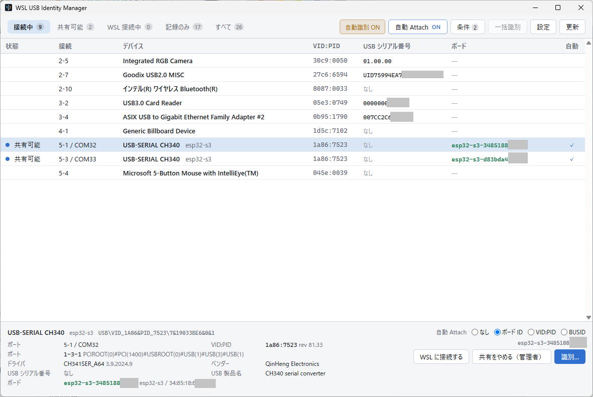

# WSL USB Identity Manager

*[English](README.md) | [日本語](README.ja.md)*

Track which physical device is which when forwarding USB devices to WSL with
[usbipd-win](https://github.com/dorssel/usbipd-win).

*Two CH340s that report no serial number, told apart by the board on the end of
each one. The interface follows the OS language; this is the Japanese one.*

## The problem

Forwarding USB devices to WSL works, until you have more than one of the same adapter.

- **A CH340 reports no serial number.** With three of them plugged in, nothing in the
  USB descriptors tells them apart. Windows can only say which port each one sits in.
- **The bus ID is not a stable name.** `usbipd`'s bus ID is `Hub_#NNNN` plus
  `Port_#MMMM`, and the hub number is assigned in the order Windows happens to
  enumerate hubs. Plug a dock in later and every device behind it gets a different
  bus ID — the same bus ID now points at a different device.
- **COM numbers and `/dev/ttyUSB*` move too**, for the same reason.
- **An adapter or a probe names itself, not what is behind it.** A CH340's serial
  number — when it has one — belongs to the adapter, not to the board it is wired to.
  A WCH-LinkE's serial number belongs to the probe; swap the board on its debug pins
  and that serial does not change.

So "attach the CH340 to Ubuntu" is not a question this tooling can answer today.

## What this tool identifies

When you say "that device", you usually mean the board — not the adapter in front of
it. There are up to three separate things on one cable:

| | Example | How it is identified |
| --- | --- | --- |
| **Port** | bus ID, `COM8`, `/dev/ttyUSB2` | physical topology path — never persisted |
| **Transport** | CH340, CH343, WCH-LinkE | USB descriptors, when a serial number exists |
| **Target** | ESP32-S3, CH32X035 | by asking the board itself |

**Identifying the target — the board behind the adapter or probe — is the point of
this tool.** For a board with native USB the transport and the target are the same
thing, and its serial number is already enough. For everything else, the board has to
be asked.

### Currently supported targets

| Family | Identified by |
| --- | --- |
| **ESP32** (behind a CH340, CP210x, …) | eFuse MAC and chip type |
| **CH32 RISC-V** (behind a WCH-Link / WCH-LinkE) | factory UUID and chip signature, via [ch32rv](https://github.com/ch32-riscv-ug/ch32rv) |

Anything else — Arduino, RP2040, STM32, or a bare adapter with an unknown board on it
— is identified down to the transport only, and says so rather than pretending
otherwise. Adding a family is meant to be additive.

## What it does

**Shares and attaches.** `usbipd` has to be sharing a device before WSL can take it, so
a row offers share, attach, detach and stop sharing in the order they are used. Sharing
needs administrator rights; the prompt appears at that moment and nowhere else, so the
application itself runs unelevated. A device that is only a bind record — shared once,
now unplugged — can still be un-shared.

**Identifies.** Press identify on a row to ask the board what it is. A device with no
serial number is identified on its own in the seconds after it is plugged in, before
anything has opened it; that can be switched off, or a VID:PID excluded from it. An
adapter that reports a serial number is left alone by that rule, so identify-all is
there for the rest.

**Attaches automatically.** A rule names a device by its board ID, its USB serial
number, its VID:PID or its bus id, and matching devices are handed to WSL as soon as
`usbipd` is sharing them. The switch is in the toolbar, not buried in a dialog.

Two things it deliberately will not do on your behalf: it never *shares* a device
automatically, because that needs administrator rights and an automatic action should
not raise a UAC prompt, and it never identifies a board in order to decide whether to
attach it — a board-ID rule waits until the board has been identified for its own
reasons.

## The approach

Separate **where a device is plugged in** from **what device it is**.

| | Examples | Kept |
| --- | --- | --- |
| Runtime connection | bus ID, COM number, `/dev/ttyUSB0`, attach state | shown, never used as a name |
| USB identity | VID/PID, USB serial, port path | read from Windows every time |
| Target identity | the board ID read from the target itself | for as long as the device stays plugged in |
| What it was last time | the name and board ID a device last had | saved, shown greyed, never acted on |
| Your own settings | auto-attach rules, what to leave alone | saved |

Anything that cannot be pinned down from USB descriptors is identified by **asking the
target board itself** — the same conclusion
[board-identify](https://github.com/tanakamasayuki/board-identify) reached on the Linux
side.

Asking the board disturbs it: reading an ESP32's eFuse MAC restarts the firmware, and
attaching to a WCH-Link halts the target core. So probing is not something this tool
does on a timer. It probes when you press the button, or in a short window right after
a device is plugged in, when nothing is using it yet.

**What a probe found is dropped when the device is unplugged.** Nothing in USB says
whether the board on the end of a CH340 was swapped while it was out, so a remembered
answer would be a guess wearing the clothes of a fact. Unplug it, plug it back in, and
it is an unidentified device again — press identify, or let the automatic window do it.
A device that has not been identified says so, rather than showing a name that might
belong to something else.

## Scope

This tool owns the Windows side: enumeration, identification, `usbipd` state and
operations, and the rules for attaching to WSL automatically.

It does **not** manage anything inside WSL — no udev rules, no device node permissions,
no symlinks. Those stay with the existing Linux-side tooling. When the information is
available, it is displayed, never modified.

## Requirements

- Windows 10 or 11 (x64)
- [usbipd-win](https://github.com/dorssel/usbipd-win) 5.x
- WSL 2
- WebView2 Runtime — included in Windows 11, and already present on the vast majority
  of Windows 10 machines

## Installation

Download the installer or the portable ZIP from the
[latest release](https://github.com/tanakamasayuki/wsl-usb-identity-manager/releases/latest).

| | |
| --- | --- |
| `wsl-usb-identity-manager_<version>_x64_setup.exe` | Installs for the current user. No administrator rights. |
| `wsl-usb-identity-manager_<version>_x64_portable.zip` | Unpack and run. Keeps its settings and log beside the executable. |

Builds are not code-signed, so Windows SmartScreen warns on first run until the
download has built up a reputation.

## Documentation

Every document is kept in English and Japanese, linked to each other at the top.

- [Requirements](docs/requirements.md)
- [Measured facts](docs/research-findings.md) — the measurements this design rests on
- [Identification policy](docs/identification-policy.md)
- [Release procedure](docs/release.md) — and how to build it yourself

## Related projects

- [board-identify](https://github.com/tanakamasayuki/board-identify) — the Linux-side
  counterpart, publishing stable symlinks inside WSL
- [ch32rv](https://github.com/ch32-riscv-ug/ch32rv) — WCH-Link probe implementation
- [usbipd-win](https://github.com/dorssel/usbipd-win) — the USB/IP host this tool drives

## License

MIT. See [LICENSE](LICENSE).
